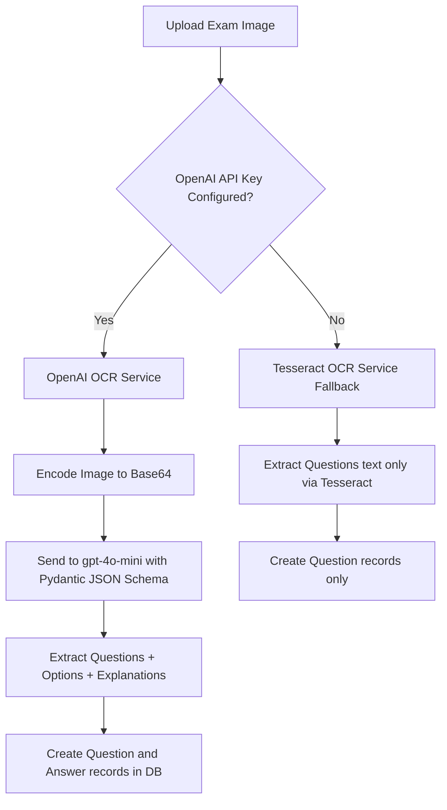

# SDD Exploration: OpenAI Vision (gpt-4o-mini) Integration

This document outlines the findings and architectural paths for replacing/enhancing the Tesseract-based OCR service with an OpenAI-powered Vision and Structuring pipeline.

## 1. Objectives
* Move away from fragile Regex-based question segmenting.
* Automatically extract multiple-choice options (incorrect, correct, explanations, etc.) and save them directly in the database, allowing immediate practice sessions after exam upload.
* Enhance support for complex exam layouts (columns, tables, code blocks) using GPT-4o-mini's layout-understanding capabilities.
* Establish a clean fallback strategy in case the OpenAI API key is not configured (retaining Tesseract functionality).

## 2. Current Architecture & Limitations
The current pipeline (`app/services/ocr_service.py`) works as follows:
1. Receives an image or PDF.
2. Preprocesses the image (contrast enhancement, median filter).
3. Executes `pytesseract.image_to_string()` using a configured CLI command.
4. Performs regular expression checks (`_segment_questions`) to find patterns like `1.` or `Pregunta 1:`.
5. Inserts only the questions using `QuestionService.create_question`.

### Key Limitations:
* **No Option Extraction:** Distractor and correct answers cannot be parsed reliably. Exams are uploaded but cannot be used for practice sessions until the user manually inputs all questions and options.
* **Fragile Regex Segmenting:** Exams with multi-column formats or nested lists completely break the regex parser.
* **Complex Setup:** Tesseract requires system-level binaries to be installed and paths to be configured, which makes deployment complex.

## 3. Proposed OpenAI Vision Concept
We will introduce a new service class (`app/services/openai_ocr_service.py` or extend `app/services/ocr_service.py` with an alternative implementation) that leverages `gpt-4o-mini`.

### Integration Flow


### Structured Outputs Schema
Using Pydantic v2 schemas and OpenAI's `response_format`, we can force the model to output a perfectly typed JSON containing:
1. Questions
2. Options (Answers) with their types (`correct`, `incorrect`), display order, and explanations for why they are correct/incorrect.

```python
from pydantic import BaseModel, Field
from app.core.constants import TopicEnum, AnswerType

class AnswerExtractionSchema(BaseModel):
    answer_text: str = Field(description="The text of the option/answer")
    answer_type: AnswerType = Field(description="Whether the answer is 'correct' or 'incorrect'")
    explanation: str | None = Field(description="Brief explanation of why this answer is correct or incorrect")
    is_common_misconception: bool = Field(default=False, description="Whether this represents a typical student mistake")

class QuestionExtractionSchema(BaseModel):
    order_in_exam: int = Field(description="The question number in the exam (1-indexed)")
    question_text: str = Field(description="The complete, clear text of the question, including any code blocks if present")
    topic: TopicEnum = Field(description="Categorize the question into one of the system topics")
    answers: list[AnswerExtractionSchema] = Field(description="List of options or answers associated with this question")

class ExamExtractionSchema(BaseModel):
    questions: list[QuestionExtractionSchema] = Field(description="List of all questions found in the exam")
```

## 4. Affected Code Components
* **`pyproject.toml`:** Add `"openai>=1.0.0"` dependency.
* **`app/config.py`:** Add settings for `openai_api_key: str | None = None` and `openai_model: str = "gpt-4o-mini"`.
* **`.env.example`:** Add `OPENAI_API_KEY` placeholder.
* **`app/services/ocr_service.py`:** Refactor to define an interface or factory, or introduce an `OpenAIOCRService` alongside the existing `OCRService`.
* **`app/api/v1/endpoints/exams.py`:** Update the upload handler to invoke the OpenAI vision pipeline and save both questions *and* their answers/options.

## 5. Next Recommended Step
Move to the `propose` phase where we will outline the concrete technical design, API payloads, prompt structure, and database operations.
